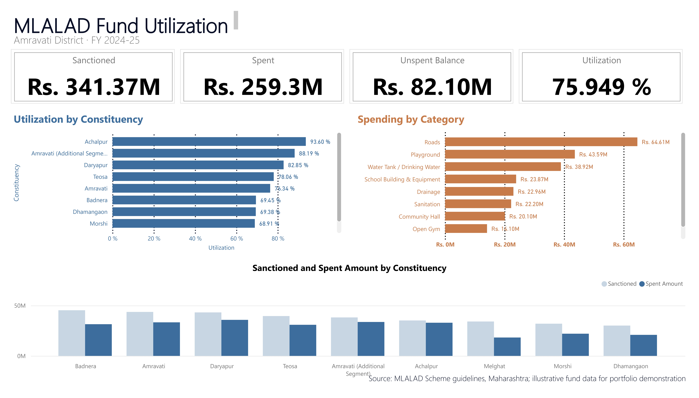

# MLALAD Fund Analytics — Amravati District, FY 2024-25

Analysis of MLA Local Area Development (MLALAD) fund utilization across 9
constituencies in Amravati district, Maharashtra — built with Python
(Pandas, Matplotlib) and visualized in an interactive Power BI dashboard.

## ⚠️ About the data in this repo

This project recreates the structure and analysis approach of a real
internship project (District Collector's office), but the dataset here is
**not the actual disclosed government data**:

- District, 8 official constituencies, and the ₹5 Cr/MLA/year MLALAD
  entitlement are **real, sourced facts**
- MLA identities are **anonymized** (labeled "MLA - [Constituency]") rather
  than using real politicians' names
- Individual work-level amounts, dates, and statuses are **illustrative**,
  generated to be realistic for portfolio/demonstration purposes

This is a working proof-of-concept of the analysis pipeline and dashboard
design, not a reproduction of confidential or actual disclosed figures.

## What's in this repo

| File | Purpose |
|---|---|
| `mla_fund_dataset.csv` | Work-level fund records (106 rows, 9 constituencies) |
| `generate_dataset.py` | Script that generates the dataset |
| `analyze_mla_fund.py` | Script version of the analysis (saves charts/Excel to disk) |
| `mla_fund_analysis.ipynb` | Notebook version — same analysis, runs cell-by-cell with inline charts |
| `insights_summary.xlsx` | Summary workbook (MLA-wise, category-wise, status) |
| `charts/` | Generated chart images |
| `MLA_Fund_Dashboard` (Power BI) | Interactive dashboard — [link to published report, if published] |

## Key findings

- **₹34.1 Cr** total sanctioned across 9 constituencies, FY 2024-25
- **₹25.9 Cr** spent — **75.9%** overall utilization
- **₹8.2 Cr** unspent balance identified
- **Roads** is the top spending category
- Utilization ranged from **93.6%** (highest) to **53.4%** (lowest) across constituencies
- 

## How to run this

**Notebook (recommended — see charts inline):**
```bash
pip install pandas matplotlib openpyxl notebook
jupyter notebook mla_fund_analysis.ipynb
```
Run cells with Shift+Enter.

**Script version:**
```bash
pip install pandas numpy matplotlib openpyxl
python3 generate_dataset.py
python3 analyze_mla_fund.py
```

## Tech stack

Python (Pandas, Matplotlib, NumPy) · Power BI · Excel

---

*Built as a portfolio recreation of an internship project with the
Amravati District Collector's office.*
